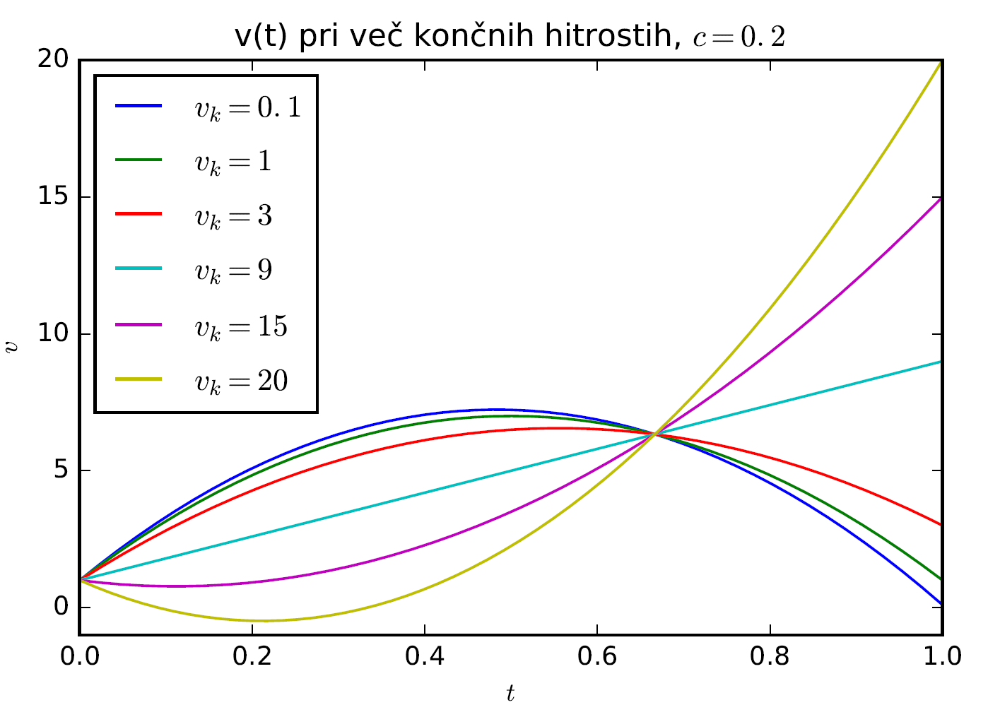

In this project I considered the following scenario: Someone is driving towards a crossroad and a red light appears. What is the optimal (in terms of fuel saving for example) braking pattern?
This was solved by expressing the problem in the language of the variational calculus (analytically) and exploring the results.

    

