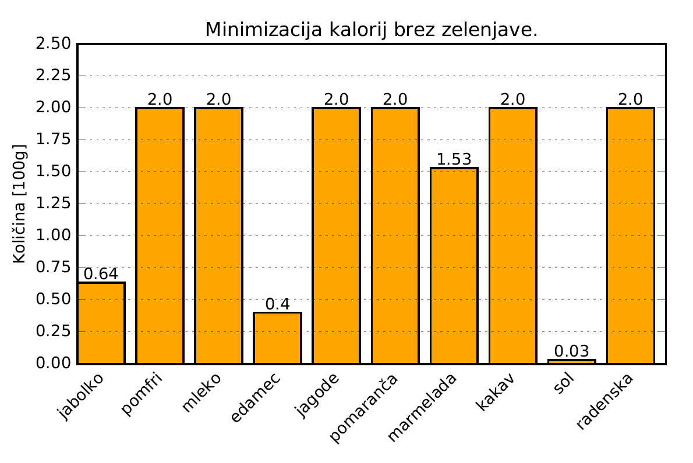

In this project I had to find an optimal diet plan within some constrains.
A typical problem was something like "minimize the number of calories if you want to eat a set number of certain food" or
"Minimize the cost if you want a minimum set number of calories, fibers, etc.". This was solved with linear programming.

    

