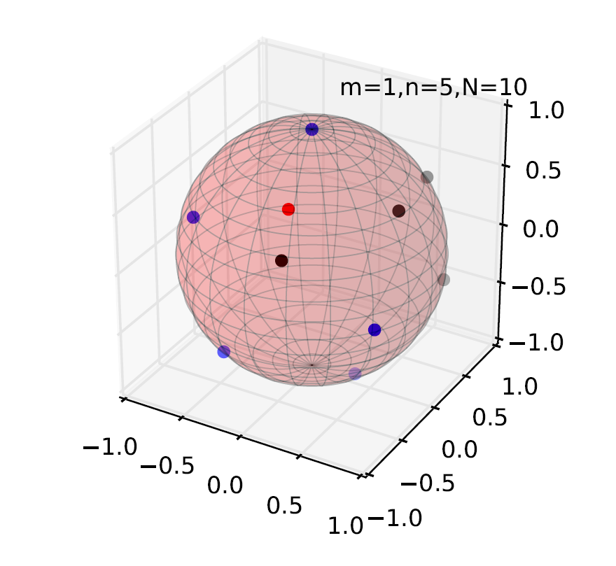

In this project I had to solve a Thomson problem and its variants.
In essence that is - find the minimum energy configuration of electron charges on a sphere. I used some nonlinear minimization schemes from scipy.optimize to achieve this.

    

