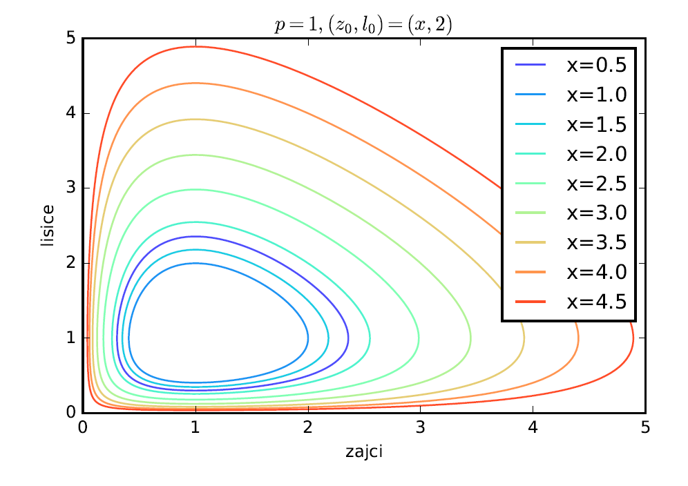

In this project I investigated the behaviour of different population models (Lotke-Volterra).
The models were solved by employing numerical integration techniques. After considering the classic rabbits-fox model, I also considered 
a population model of a laser and of a pandemic.

    

