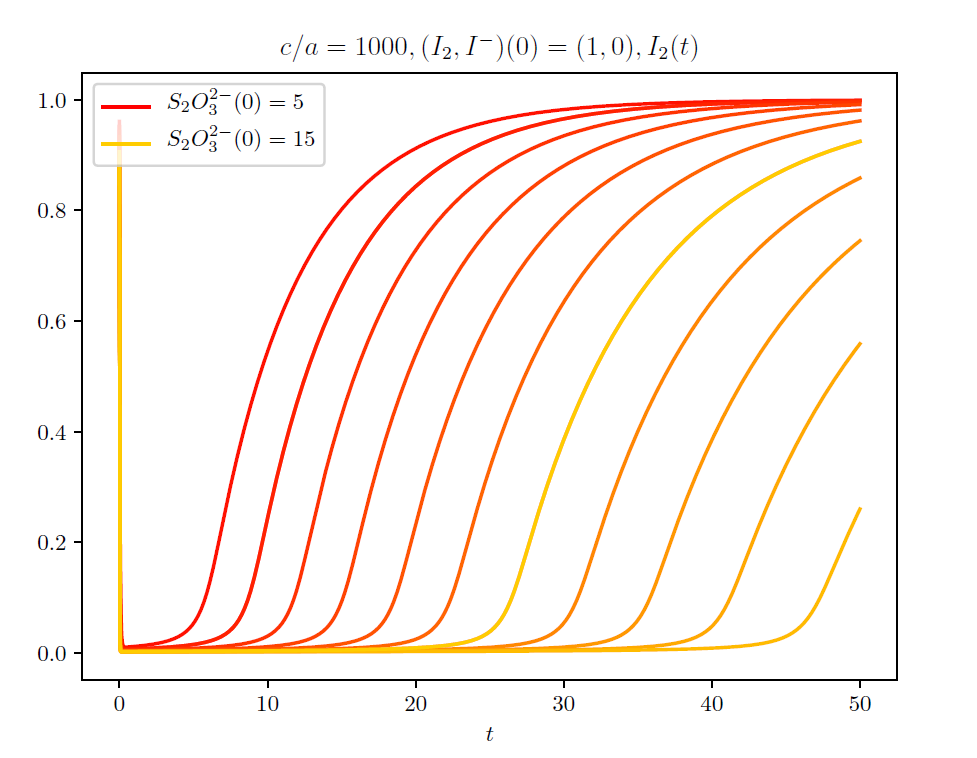

In this project I simulated some chemical reactions using a master equation, which again amounts to 
solving a certain systems of differential equations. Of particular interest was a simulation of "chemical clock"

    

