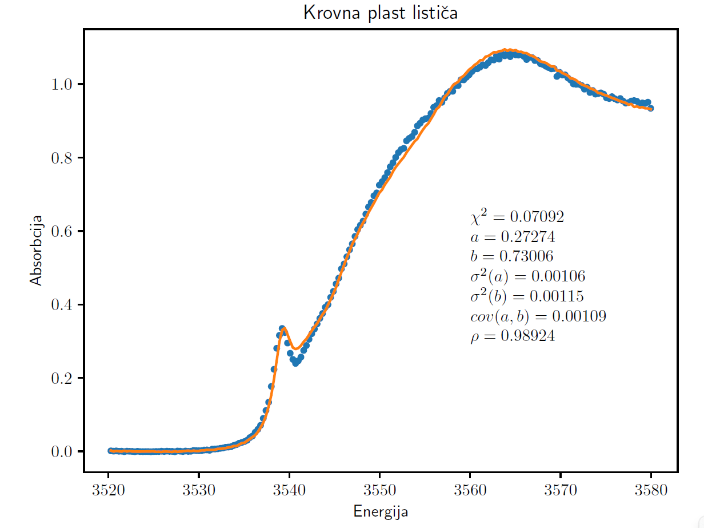

In this project I appled linear regression (with possible feature transformations to include non-linearity).
The phenomena modelled were:
- Tissue's reaction to some chemicals
- Trajectory parameters of particles from detector measurements
- Absorbtion spectra of some elements

    

