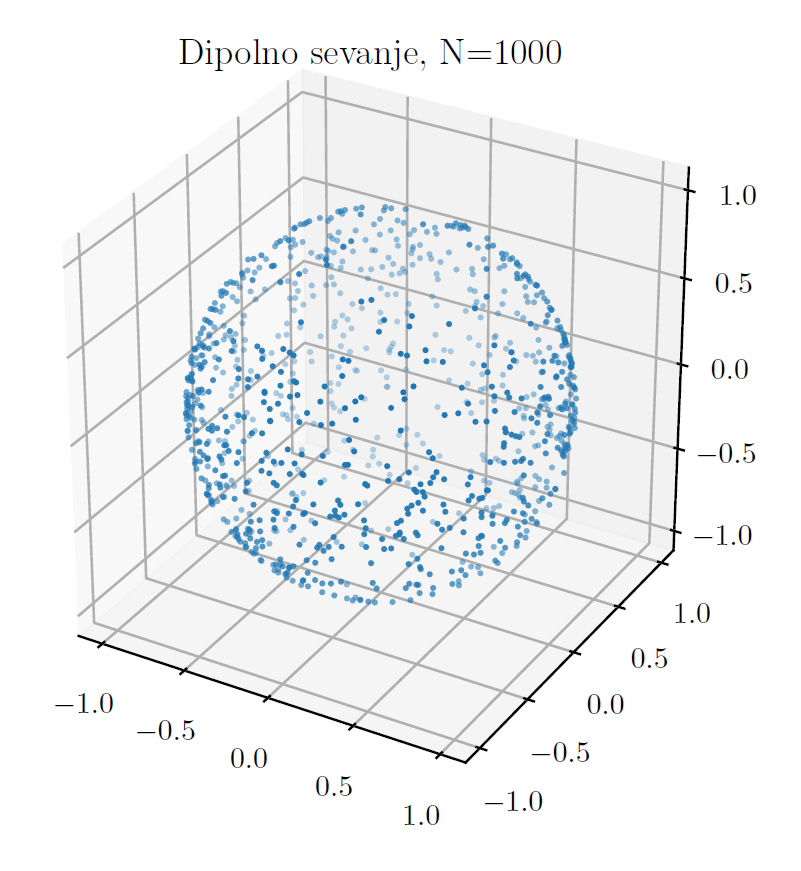

In this project I've implemented two pseudorandom number generators (Box-Muller and Convolutional) and statistically tested them.
With those generators in hand, I then simulated dipole radiation (which is not distributed uniformly over the solid angle).

    

