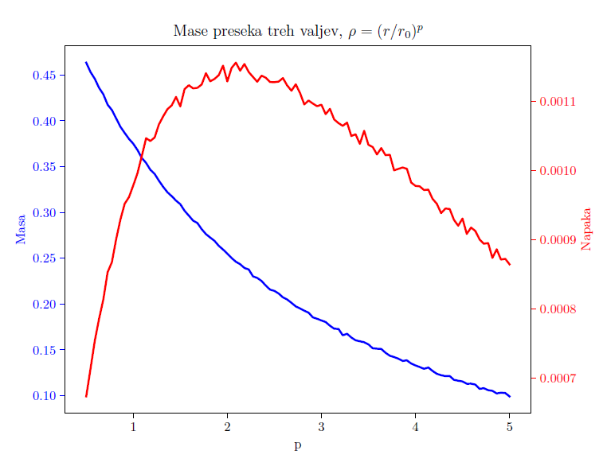

In this project I've used Monte Carlo simulations to solve the following:
- Calculate the mass and moment of inertia of a uniformly dense intersection of 3 cyllinders.
- Simulate gamma ray emissions that are generated inside a ball of finite size.
- Simulate a neutron reflector (a layer of finite thickness in which neutrons can at any time change direction with some probability)

    

