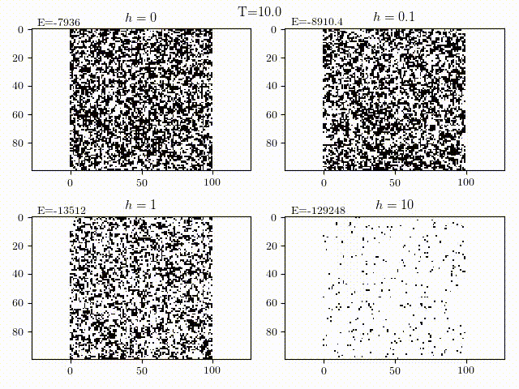

In this project I've implemented a Metropolis-Hastings algorithm with simulated annealing to model the following:
- Ground state of a molecural chain
- Ground state of the Ising model
- An attempt at a travelling salesman problem

    

