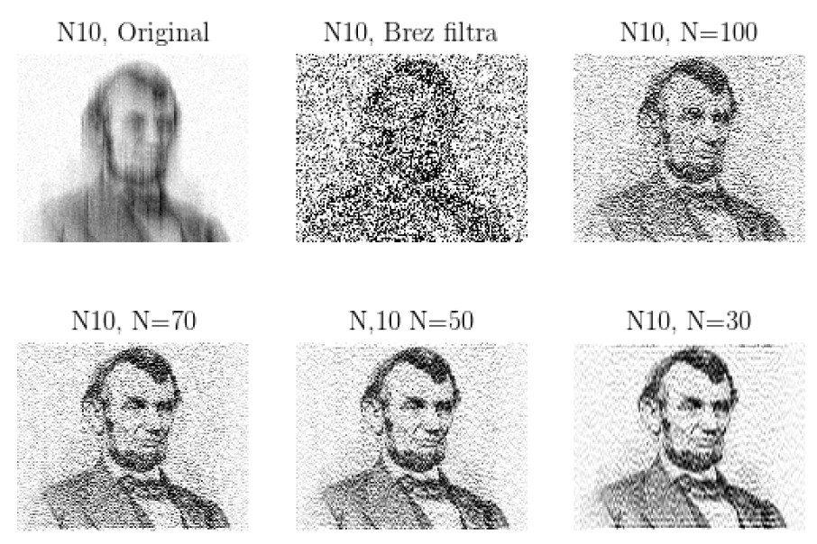

In this project I've applied Fourier Analysis to solve the following:
- Reconstructing noisy input signal using the Wiener filter
- Denoising an image with Wiener filter
- Implementing the Gaussian blur algorithm

    

